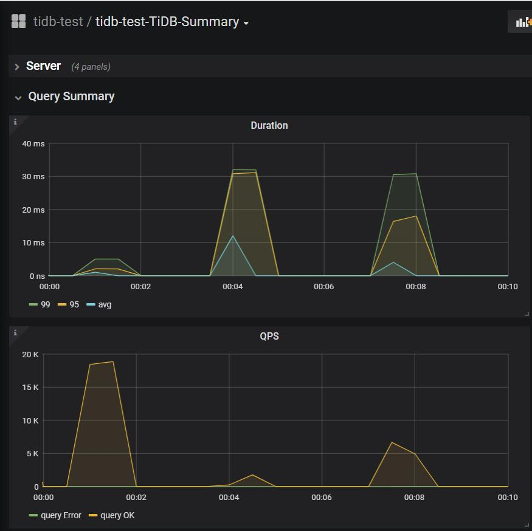
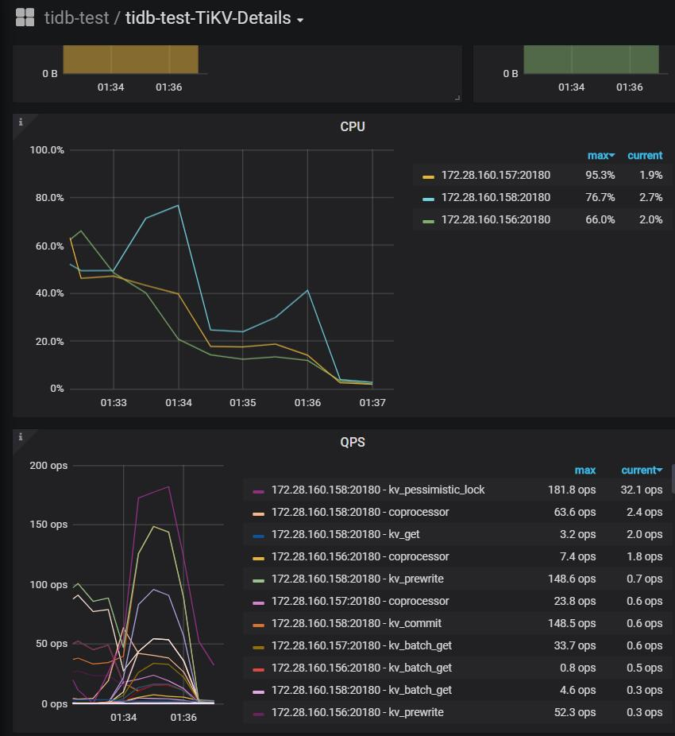

# Lesson2-对 TiDB 进行基准测试

本文是 [High Performance TiDB 课程系列](https://docs.qq.com/sheet/DSlBwS3VCb01kTnZw?tab=BB08J2) Lesson 2 的课程作业。

## 题目描述

使用 sysbench、go-ycsb 和 go-tpc 分别对 TiDB 进行测试并且产出测试报告。

测试报告需要包括以下内容：

* 部署环境的机器配置(CPU、内存、磁盘规格型号)，拓扑结构(TiDB、TiKV 各部署于哪些节点)
* 调整过后的 TiDB 和 TiKV 配置
* 测试输出结果
* 关键指标的监控截图
    * TiDB Query Summary 中的 qps 与 duration
    * TiKV Details 面板中 Cluster 中各 server 的 CPU 以及 QPS 指标
    * TiKV Details 面板中 grpc 的 qps 以及 duration

**输出：写出你对该配置与拓扑环境和 workload 下 TiDB 集群负载的分析，提出你认为的 TiDB 的性能的瓶颈所在(能提出大致在哪个模块即可)**

## 部署测试环境

这次跑 benchmark 不能本地测了，决定用阿里云。机器配置参考 [TiDB 软件和硬件环境建议配置](https://docs.pingcap.com/zh/tidb/stable/hardware-and-software-requirements)：

|实例 | 个数 | 物理机配置 | IP | 
| :-- | :-- | :-- | :-- | 
| TiDB | 1 | 8 VCore 16GB * 1 (ecs.c6e.2xlarge) | 172.28.160.154| 
| PD | 1 | 4 VCore 8GB * 1 (ecs.c6e.xlarge) |172.28.160.155| 
| TiKV | 3 | 8 VCore 32GB (ecs.g6e.2xlarge) 200GB SSD * 1 |172.28.160.156 <br/> 172.28.160.157 <br/> 172.28.160.158 |
| 压测机/中控机 | 1 | 4 VCore 8GB * 1 (ecs.c6e.xlarge) |172.28.160.159| 

### 部署过程

本来想参考[在阿里云上部署 TiDB 集群](https://docs.pingcap.com/zh/tidb-in-kubernetes/stable/deploy-on-alibaba-cloud)，直接部署集群。不过对 k8s 不熟，遇到一点小坑就放弃了（怕烧钱……）。

决定还是手动创建服务器实例，然后[使用 TiUP 部署 TiDB 集群](https://docs.pingcap.com/zh/tidb/stable/production-deployment-using-tiup)。

```bash
curl --proto '=https' --tlsv1.2 -sSf https://tiup-mirrors.pingcap.com/install.sh | sh
source .bash_profile
tiup cluster
tiup update --self && tiup update cluster
```

新建 ` topology.yaml`
```
global:
  user: "tidb"
  ssh_port: 22
  deploy_dir: "/tidb-deploy"
  data_dir: "/tidb-data"

pd_servers:
  - host: 172.28.160.155

tidb_servers:
  - host: 172.28.160.154

tikv_servers:
  - host: 172.28.160.156
  - host: 172.28.160.157
  - host: 172.28.160.158

monitoring_servers:
  - host: 172.28.160.155

grafana_servers:
  - host: 172.28.160.155

alertmanager_servers:
  - host: 172.28.160.155
```

开始部署

``` BASH
$ tiup cluster deploy tidb-test v4.0.0 ./topology.yaml --user root -p # 部署集群

Starting component `cluster`: /root/.tiup/components/cluster/v1.0.9/tiup-cluster deploy tidb-test v4.0.0 ./topology.yaml --user root -p
Please confirm your topology:
tidb Cluster: tidb-test
tidb Version: v4.0.0
Type          Host            Ports        OS/Arch       Directories
----          ----            -----        -------       -----------
pd            172.28.160.155  2379/2380    linux/x86_64  /tidb-deploy/pd-2379,/tidb-data/pd-2379
tikv          172.28.160.156  20160/20180  linux/x86_64  /tidb-deploy/tikv-20160,/tidb-data/tikv-20160
tikv          172.28.160.157  20160/20180  linux/x86_64  /tidb-deploy/tikv-20160,/tidb-data/tikv-20160
tikv          172.28.160.158  20160/20180  linux/x86_64  /tidb-deploy/tikv-20160,/tidb-data/tikv-20160
tidb          172.28.160.154  4000/10080   linux/x86_64  /tidb-deploy/tidb-4000
prometheus    172.28.160.155  9090         linux/x86_64  /tidb-deploy/prometheus-9090,/tidb-data/prometheus-9090
grafana       172.28.160.155  3000         linux/x86_64  /tidb-deploy/grafana-3000
alertmanager  172.28.160.155  9093/9094    linux/x86_64  /tidb-deploy/alertmanager-9093,/tidb-data/alertmanager-9093

# 此处省略...
Deployed cluster `tidb-test` successfully, you can start the cluster via `tiup cluster start tidb-test`

$ tiup cluster start tidb-test # 启动集群

# 此处省略...
Started cluster `tidb-test` successfully

$ tiup cluster display tidb-test
Starting component `cluster`: /root/.tiup/components/cluster/v1.0.9/tiup-cluster display tidb-test
tidb Cluster: tidb-test
tidb Version: v4.0.0
ID                    Role          Host            Ports        OS/Arch       Status   Data Dir                      Deploy Dir
--                    ----          ----            -----        -------       ------   --------                      ----------
172.28.160.155:9093   alertmanager  172.28.160.155  9093/9094    linux/x86_64  Up       /tidb-data/alertmanager-9093  /tidb-deploy/alertmanager-9093
172.28.160.155:3000   grafana       172.28.160.155  3000         linux/x86_64  Up       -                             /tidb-deploy/grafana-3000
172.28.160.155:2379   pd            172.28.160.155  2379/2380    linux/x86_64  Up|L|UI  /tidb-data/pd-2379            /tidb-deploy/pd-2379
172.28.160.155:9090   prometheus    172.28.160.155  9090         linux/x86_64  Up       /tidb-data/prometheus-9090    /tidb-deploy/prometheus-9090
172.28.160.154:4000   tidb          172.28.160.154  4000/10080   linux/x86_64  Up       -                             /tidb-deploy/tidb-4000
172.28.160.156:20160  tikv          172.28.160.156  20160/20180  linux/x86_64  Up       /tidb-data/tikv-20160         /tidb-deploy/tikv-20160
172.28.160.157:20160  tikv          172.28.160.157  20160/20180  linux/x86_64  Up       /tidb-data/tikv-20160         /tidb-deploy/tikv-20160
172.28.160.158:20160  tikv          172.28.160.158  20160/20180  linux/x86_64  Up       /tidb-data/tikv-20160         /tidb-deploy/tikv-20160

$ mysql -u root -h 172.28.160.154 -P 4000
```
通过公网 ip `{pd-ip}:2379/dashboard` 可以访问 TiDB Dashborad。`{Grafana-ip}:3000` 访问 grafana。

## 基准测试

### sysbench

``` BASH
curl -s https://packagecloud.io/install/repositories/akopytov/sysbench/script.rpm.sh | sudo os=el dist=7 bash
yum -y install sysbench
```
新建一个配置文件 `sysbench-conf`
```
mysql-host=172.28.160.154
mysql-port=4000
mysql-user=root
mysql-db=sbtest
report-interval=10
db-driver=mysql
```
准备工作
```bash
# 创建db
MySQL> create database sbtest;
# 导入数据之前先设置为乐观事务模式, 导入数据结束在设置为悲观模式
MySQL> set global tidb_disable_txn_auto_retry = off;
MySQL> set global tidb_txn_mode = "optimistic";

$ sysbench oltp_point_select --config-file=sysbench-config --tables=32 --table-size=100000 prepare

MySQL> set global tidb_txn_mode="pessimistic";
```

#### Point select 测试
``` BASH
$ sysbench oltp_point_select --config-file=sysbench-config --threads=128 --tables=32 --table-size=100000 run

[ 10s ] thds: 128 tps: 83609.56 qps: 83609.56 (r/w/o: 83609.56/0.00/0.00) lat (ms,95%): 2.86 err/s: 0.00 reconn/s: 0.00
SQL statistics:
    queries performed:
        read:                            838242
        write:                           0
        other:                           0
        total:                           838242
    transactions:                        838242 (83590.67 per sec.)
    queries:                             838242 (83590.67 per sec.)
    ignored errors:                      0      (0.00 per sec.)
    reconnects:                          0      (0.00 per sec.)

General statistics:
    total time:                          10.0266s
    total number of events:              838242

Latency (ms):
         min:                                    0.30
         avg:                                    1.53
         max:                                   24.73
         95th percentile:                        2.86
         sum:                              1280585.78

Threads fairness:
    events (avg/stddev):           6548.7656/30.83
    execution time (avg/stddev):   10.0046/0.01
```


#### Update index 测试
``` BASH
$ sysbench oltp_update_index --config-file=sysbench-config --threads=128 --tables=32 --table-size=100000 run

SQL statistics:
    queries performed:
        read:                            0
        write:                           70427
        other:                           0
        total:                           70427
    transactions:                        70427  (7023.63 per sec.)
    queries:                             70427  (7023.63 per sec.)
    ignored errors:                      0      (0.00 per sec.)
    reconnects:                          0      (0.00 per sec.)

General statistics:
    total time:                          10.0258s
    total number of events:              70427

Latency (ms):
         min:                                   10.60
         avg:                                   18.19
         max:                                  251.34
         95th percentile:                       22.28
         sum:                              1281230.95

Threads fairness:
    events (avg/stddev):           550.2109/7.13
    execution time (avg/stddev):   10.0096/0.01
```


#### Read write 测试
``` BASH
$ sysbench oltp_read_write --config-file=sysbench-config --threads=128 --tables=32 --table-size=100000 run

[ 10s ] thds: 128 tps: 1110.76 qps: 22390.51 (r/w/o: 15699.17/4457.43/2233.91) lat (ms,95%): 150.29 err/s: 0.00 reconn/s: 0.00
SQL statistics:
    queries performed:
        read:                            157332
        write:                           44952
        other:                           22476
        total:                           224760
    transactions:                        11238  (1110.39 per sec.)
    queries:                             224760 (22207.82 per sec.)
    ignored errors:                      0      (0.00 per sec.)
    reconnects:                          0      (0.00 per sec.)

General statistics:
    total time:                          10.1194s
    total number of events:              11238

Latency (ms):
         min:                                   53.17
         avg:                                  114.47
         max:                                  245.92
         95th percentile:                      150.29
         sum:                              1286458.52

Threads fairness:
    events (avg/stddev):           87.7969/1.27
    execution time (avg/stddev):   10.0505/0.03
```

#### 关键指标的监控截图

TiDB Query Summary 中的 qps 与 duration


TiKV Details 面板中 Cluster 中各 server 的 CPU 以及 QPS 指标


TiKV Details 面板中 grpc 的 qps 以及 duration


### go-ycsb
```bash
git clone https://github.com/pingcap/go-ycsb.git
cd go-ycsb
make

# 导入数据
./bin/go-ycsb load mysql -P workloads/workloada -p recordcount=100000 -p mysql.host=172.28.160.154 -p mysql.port=4000 --threads 32

# 测试
./bin/go-ycsb run mysql -P workloads/workloada -p recordcount=100000 -p mysql.host=172.28.160.154 -p mysql.port=4000 --threads 32

Run finished, takes 201.034517ms
READ   - Takes(s): 0.2, Count: 528, OPS: 2660.7, Avg(us): 1174, Min(us): 760, Max(us): 4845, 99th(us): 4000, 99.9th(us): 5000, 99.99th(us): 5000
UPDATE - Takes(s): 0.2, Count: 464, OPS: 2464.6, Avg(us): 10271, Min(us): 5676, Max(us): 14897, 99th(us): 14000, 99.9th(us): 15000, 99.99th(us): 15000
```


### go-tpc
```bash 
git clone https://github.com/pingcap/go-tpc.git
cd go-tpc
make build

```
#### TPCC
```bash 
./bin/go-tpc tpcc -H 172.28.160.154 -P 4000 -D tpcc --warehouses 10 prepare
./bin/go-tpc tpcc -H 172.28.160.154 -P 4000 -D tpcc --warehouses 10 run

[Summary] DELIVERY - Takes(s): 113.2, Count: 149, TPM: 79.0, Sum(ms): 14571, Avg(ms): 97, 90th(ms): 160, 99th(ms): 160, 99.9th(ms): 192
[Summary] NEW_ORDER - Takes(s): 113.6, Count: 1771, TPM: 935.3, Sum(ms): 56337, Avg(ms): 31, 90th(ms): 40, 99th(ms): 48, 99.9th(ms): 80
[Summary] ORDER_STATUS - Takes(s): 112.8, Count: 162, TPM: 86.2, Sum(ms): 731, Avg(ms): 4, 90th(ms): 8, 99th(ms): 8, 99.9th(ms): 8
[Summary] PAYMENT - Takes(s): 113.5, Count: 1707, TPM: 902.0, Sum(ms): 38801, Avg(ms): 22, 90th(ms): 32, 99th(ms): 40, 99.9th(ms): 80
[Summary] PAYMENT_ERR - Takes(s): 113.5, Count: 1, TPM: 0.5, Sum(ms): 12, Avg(ms): 12, 90th(ms): 12, 99th(ms): 12, 99.9th(ms): 12
[Summary] STOCK_LEVEL - Takes(s): 113.0, Count: 161, TPM: 85.5, Sum(ms): 1222, Avg(ms): 7, 90th(ms): 9, 99th(ms): 16, 99.9th(ms): 20
tpmC: 935.3
```

##### 关键指标的监控截图

TiDB Query Summary 中的 qps 与 duration


TiKV Details 面板中 Cluster 中各 server 的 CPU 以及 QPS 指标


TiKV Details 面板中 grpc 的 qps 以及 duration


#### TPCH
```bash 
$ ./bin/go-tpc tpch prepare -H 172.28.160.154 -P 4000 -D tpch --sf 1
$ ./bin/go-tpc tpch run -H 172.28.160.154 -P 4000 -D tpch --sf 1

[Summary] Q1: 1.51s
[Summary] Q10: 0.71s
[Summary] Q11: 0.82s
[Summary] Q12: 0.68s
[Summary] Q13: 0.97s
[Summary] Q14: 0.64s
[Summary] Q15: 1.17s
[Summary] Q16: 0.42s
[Summary] Q17: 1.62s
[Summary] Q18: 2.55s
[Summary] Q19: 0.88s
[Summary] Q2: 0.79s
[Summary] Q20: 0.58s
[Summary] Q21: 1.46s
[Summary] Q22: 0.53s
[Summary] Q3: 1.07s
[Summary] Q4: 0.62s
[Summary] Q5: 10.23s
[Summary] Q6: 0.52s
[Summary] Q7: 0.95s
[Summary] Q8: 1.29s
[Summary] Q9: 2.15s
```

##### 关键指标的监控截图

TiDB Query Summary 中的 qps 与 duration


TiKV Details 面板中 Cluster 中各 server 的 CPU 以及 QPS 指标


TiKV Details 面板中 grpc 的 qps 以及 duration


## 分析与总结

购买部署云服务器、跑 benchmark 测试性能都是第一次，有很多东西都不太熟悉。严肃的基准测试准备数据，仔细测试要花不少时间，由于有点担心开销（几小时便花费大几十），过了一遍就匆匆结束了。

关于性能瓶颈所在，感觉很多测试甚至都没跑到瓶颈。不太能够发现问题所在。

因此这次作业只能算是体验了一下流程，进行了一点初步尝试。还需在实践中积累经验~